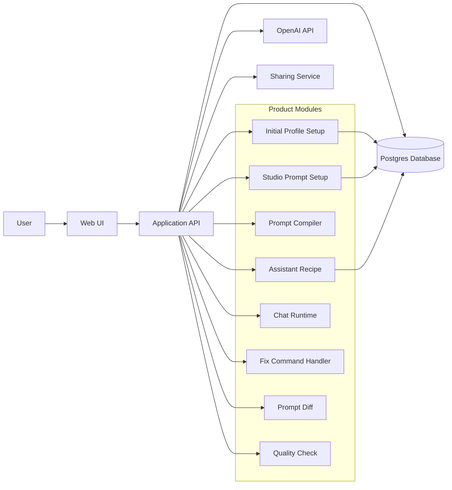

# MIVA Product Plan

## 1. 제품 정의

MIVA는 단순한 prompt generator가 아니다. 사용자가 반복해서 수행하는 AI 작업 방식, 답변 취향, 출력 형식, 피드백 규칙을 저장 가능한 **Assistant Recipe** 또는 **AI Workstyle**로 바꾸는 제품이다.

핵심 포지셔닝은 다음과 같다.

- **Canva for custom AI assistants**
- **Promptless AI assistant builder**
- **Shareable AI workstyles**
- **Create, reuse, and share your AI work style**

MIVA의 목표는 사용자가 매번 새 AI 채팅을 시작할 때 같은 설명을 반복하지 않도록 돕는 것이다. 사용자의 반복 AI workflow를 안정적인 assistant로 저장하고, 필요하면 공유하거나 remix할 수 있게 만든다.

## 2. 해결하려는 문제

사용자는 새 AI 채팅을 시작할 때마다 다음 내용을 반복해서 설명한다.

- AI가 어떤 역할을 해야 하는지
- 답변이 얼마나 자세해야 하는지
- 어떤 형식으로 답변해야 하는지
- 어떤 말투와 태도를 선호하는지
- 지금 어떤 종류의 작업을 하고 있는지
- 이전 답변에서 무엇이 마음에 들지 않았는지

이 설정은 새 대화로 넘어가면 사라지거나 약해진다. MIVA는 이 반복 설정을 **task-specific custom AI assistant**로 저장하여 문제를 해결한다.

| 기존 AI 채팅의 문제 | MIVA의 해결 방향 |
| --- | --- |
| 매번 역할과 형식을 다시 설명해야 함 | Assistant Recipe로 저장 |
| 사용자가 직접 prompt를 잘 써야 함 | MIVA가 인터뷰하고 prompt rule로 변환 |
| 답변 취향이 대화마다 흔들림 | Style rules와 response format을 버전 관리 |
| 좋은 assistant를 남에게 전달하기 어려움 | Share, Try, Save, Remix, Adapt to Me 제공 |
| 불만 피드백이 일회성으로 끝남 | `/fix`로 durable prompt rule에 반영 |

## 3. 제품 원칙

MIVA는 다음 원칙을 따른다.

- **Promptless first**: 사용자가 prompt를 직접 작성하지 않아도 assistant를 만들 수 있어야 한다.
- **Conversation-first setup**: 초기 설정과 assistant 생성은 긴 form이 아니라 자연스러운 인터뷰 흐름이어야 한다.
- **Preview-driven building**: 최종 저장 전에 sample conversation과 sample response를 먼저 보여준다.
- **Feedback becomes rules**: 사용자의 자연어 피드백을 raw sentence로 저장하지 않고 구조화된 prompt rule로 변환한다.
- **Reusable by default**: 결과물은 단순 문자열이 아니라 저장, 실행, 수정, 공유 가능한 Assistant Recipe여야 한다.
- **Shareable and remixable**: 좋은 AI workstyle은 다른 사람이 try, save, remix, adapt할 수 있어야 한다.
- **Privacy-aware onboarding**: 정확한 나이, 생년월일, 전화번호, 주소, 주민등록번호, 실제 회사명 같은 민감한 식별자는 요구하지 않는다.

## 4. 핵심 용어

| 용어 | 의미 |
| --- | --- |
| **Assistant Recipe** | assistant의 목적, 대상 사용자, workflow, response format, rules, examples, final system prompt를 포함하는 저장 단위 |
| **AI Workstyle** | 사용자가 AI에게 기대하는 작업 방식, 답변 스타일, 피드백 패턴의 묶음 |
| **Style Builder** | 인터뷰, sample preview, feedback을 통해 Assistant Recipe를 만드는 기능 |
| **Style Preview** | 저장 전 sample user message와 assistant response를 보여주는 미리보기 |
| **Adapt to Me** | 다른 사용자의 assistant를 내 profile context에 맞게 변환하는 기능 |
| **Remix** | 기존 assistant를 복사해 목적, 말투, 형식, 대상 사용자 등을 수정하는 기능 |
| **Prompt Diff** | remix 또는 `/fix` 이후 prompt rule과 final prompt 변경점을 보여주는 기능 |
| **Quality Check** | 공유 전 prompt의 명확성, 구체성, 일관성, 안전성, 예시 품질을 점검하는 기능 |

## 5. 주요 사용자 흐름

MIVA의 전체 흐름은 **Initial Setup stores user context**와 **Studio creates assistant context**를 분리해야 한다.

1. 사용자가 Initial Profile Setup을 완료한다.
2. MIVA는 사용자의 stable background context만 `user_profiles`에 저장한다.
3. 사용자가 특정 assistant를 만들기 위해 Studio에 들어간다.
4. Studio가 `user_profiles`를 읽는다.
5. 사용자가 만들 assistant의 목적을 선택하거나 직접 설명한다.
6. MIVA가 사용자의 profile context를 사용해 assistant setup questions를 생성한다.
7. 사용자가 assistant-specific answers, sample material, example task를 제공한다.
8. MIVA가 Style Preview 또는 sample conversation을 생성한다.
9. 사용자가 자연어로 피드백한다.
10. MIVA가 피드백을 prompt rules로 변환한다.
11. MIVA가 final custom AI prompt를 생성한다.
12. 사용자가 assistant를 Assistant Recipe로 저장한다.
13. 사용자는 저장된 assistant와 채팅한다.
14. 사용자는 chat 중 `/fix`를 사용해 assistant prompt를 업데이트할 수 있다.
15. 사용자는 나중에 assistant를 share, remix, adapt할 수 있다.

## 6. Initial Profile Setup

Initial Profile Setup의 목적은 사용자의 안정적인 배경 context를 이해하는 것이다. 이 단계가 답해야 하는 질문은 **"Who is this user?"**다.

Initial Profile Setup is not the place to customize an assistant. It only creates the user's background context so Studio can later ask better assistant-specific questions.

Initial Profile Setup은 사용자가 어떤 AI assistant를 만들고 싶은지, 어떤 response format을 원하는지, 어떤 workflow preference를 갖는지, 특정 assistant가 어떻게 행동해야 하는지는 묻지 않는다. 저장되는 정보는 `user_profiles`의 source of truth로 들어가야 한다. assistant-specific settings는 Studio에서 생성하고 Assistant Recipe 또는 관련 assistant tables에 저장한다.

### UX 방향

- 한 번에 하나의 질문만 보여준다.
- 사용자는 버튼으로 빠르게 답할 수 있다.
- 다음 질문은 이전 답변 아래에 자연스럽게 이어진다.
- 선택지는 한 줄에 하나씩 표시한다.
- 각 선택지는 full-width row button으로 보여준다.
- 이전 답변은 compact style로 계속 보이게 한다.
- "Something else" 또는 custom input 선택 시 바로 아래에 text input을 보여준다.
- 민감한 항목에는 skip 또는 prefer-not-to-say를 제공한다.
- 마지막에는 profile summary와 Save Profile 버튼을 보여준다.
- 이 flow는 Profile step 또는 Initial Setup profile section에 속하며, 이후 Studio prompt builder와 분리한다.

권장 질문 수:

- 기본: 4~5개
- 최대: 필요한 경우에만 6개
- 어린 사용자: 더 적고 단순한 질문

### 수집할 Stable Profile Data

- age group
- current status
- education 또는 work context
- field, major, 또는 role
- approximate expertise level
- preferred language

Initial Profile Setup에서는 다음 정보를 수집하지 않는다.

- assistant purpose
- response format
- output style
- repeated AI tasks
- workflow preferences
- assistant behavior
- sample material
- preview feedback
- final prompt rules

### Hardcoded Questions, Flexible Answers

Profile questions 자체는 hardcoded해도 된다. Initial Profile Setup은 짧고 예측 가능한 flow가 더 중요하므로, OpenAI API로 매 질문을 생성할 필요는 없다.

대신 답변 선택지는 빠른 입력을 위해 predefined options를 제공하고, 모든 질문의 마지막에는 **Something else** 또는 **Custom input**을 둔다. 사용자는 빠르게 선택할 수 있고, 선택지가 맞지 않을 때는 자신의 context를 직접 입력할 수 있다.

예시:

```text
Question:
What best describes your current situation?

Options:
- College student
- Job seeker
- Employed
- Founder
- Freelancer
- Something else
```

`Something else`를 선택하면 direct text input을 보여준다.

### Initial Profile Question Set

권장 hardcoded question flow는 다음과 같다.

#### Q1. Age Group

- Under 13
- Teenager
- 20s
- 30s
- 40s
- 50s+
- Prefer not to say
- Something else

#### Q2. Current Status

Age group에 따라 선택지를 다르게 보여줄 수 있다.

Teenager:

- Elementary school student
- Middle school student
- High school student
- Preparing for college
- Not a student
- Prefer not to say
- Something else

20s:

- College student
- Graduate student
- Job seeker
- Employed
- Founder
- Freelancer
- Something else

30s and above:

- Employed
- Founder
- Freelancer
- Parent / homemaker
- Teacher
- Student
- Something else

#### Q3. Education or Work Context

현재 상태에 따라 질문을 바꾼다.

College student / Graduate student:

```text
What is your major or field of study?
```

- Computer Science
- Engineering
- Math / Statistics
- Business
- Design
- Humanities
- Social Science
- Something else

Job seeker:

```text
What field are you preparing for?
```

- Software engineering
- Data / AI
- Design
- Marketing
- Business / finance
- Education
- Something else

Employed:

```text
What kind of work do you do?
```

- Software / engineering
- Education
- Business / operations
- Marketing / sales
- Healthcare
- Creative work
- Something else

Teacher:

```text
Who do you mainly teach?
```

- Elementary students
- Middle school students
- High school students
- College students
- Adults
- Something else

Parent / homemaker:

```text
Which best describes your current context?
```

- Parent
- Homemaker
- Caregiver
- Managing household tasks
- Learning or personal projects
- Prefer not to say
- Something else

#### Q4. Approximate Expertise Level

- Beginner
- Intermediate
- Advanced
- Not sure
- Something else

어린 사용자에게는 더 쉬운 표현을 사용한다.

```text
How should MIVA understand your level?
```

- Just starting
- I know the basics
- I can handle harder topics
- Not sure
- Something else

#### Q5. Preferred Language

- Korean
- English
- Korean with English technical terms
- English with Korean explanations
- Something else

#### Q6. Optional Additional Background

필요한 경우에만 묻는다.

```text
Is there anything else MIVA should know about your background?
```

- Skip
- Add a short note

### Profile Branching 예시

| 사용자의 선택 | 후속 질문 방향 |
| --- | --- |
| Teenager | school stage 또는 college preparation처럼 단순하고 안전한 context만 묻는다. |
| 20s | college student, job seeker, employed, founder, freelancer 등 현재 상태를 묻는다. |
| College student | major 또는 field of study를 묻는다. assistant task는 묻지 않는다. |
| Job seeker | 준비 중인 field를 묻는다. resume나 interview preference는 Studio에서 묻는다. |
| Employed | industry 또는 role을 묻는다. 업무 workflow preference는 Studio에서 묻는다. |
| Teacher | 주로 가르치는 대상을 묻는다. teaching assistant 설정은 Studio에서 묻는다. |

### Privacy 원칙

- 정확한 나이를 묻지 않는다.
- 생년월일을 묻지 않는다.
- 실제 회사명을 필수로 요구하지 않는다.
- 전화번호, 주소, 신분증, 개인 식별자는 묻지 않는다.
- 민감할 수 있는 질문에는 skip 또는 prefer-not-to-say를 제공한다.
- 미성년자에게는 일반적이고 안전한 범위의 질문만 한다.

## 7. Style Builder

Style Builder는 Studio 안에서 동작한다. Initial Profile Setup이 사용자의 배경 context를 저장한다면, Studio Prompt Setup은 특정 assistant를 만든다.

개념적으로는 다음처럼 분리한다.

| 단계 | 핵심 질문 | 저장 위치 |
| --- | --- | --- |
| Initial Setup | Who is this user? | `user_profiles` |
| Studio | What assistant does this user want to build? | Assistant setup draft |
| Prompt Builder | How should that assistant behave? | Assistant Recipe |
| Chat | Use the saved assistant prompt. | ChatMessage |
| `/fix` | Improve the assistant prompt based on real usage. | PromptVersion, FixCommand |

Studio는 profile questions를 다시 묻지 않아야 한다. profile이 없거나 오래된 경우에만 profile update를 안내하고, 기본적으로는 저장된 `user_profiles`를 읽어 assistant setup questions를 개인화한다.

Studio에서 MIVA는 다음 정보를 조합해 assistant-specific question을 생성한다.

- stored `user_profiles`
- assistant purpose
- previous answers
- sample task 또는 material
- desired output style

예시 stored profile:

```text
The user is in their 20s, is a college student studying Computer Science,
has intermediate expertise, and prefers Korean explanations with English technical terms.
```

Assistant purpose:

```text
Assignment summarizer
```

Studio-generated question:

```text
What type of CS material do you usually need summarized?
```

Options:

- Research paper
- Lecture notes
- Assignment instructions
- Documentation
- Code explanation
- Something else

### Assistant Purpose 예시

| Assistant 유형 | 주요 사용 예시 |
| --- | --- |
| Assignment summarizer | 강의자료, 논문, 교재 내용을 과제용으로 요약 |
| Math problem solver | 풀이 과정을 단계별로 설명 |
| Travel planner | 예산, 일정, 동선에 맞는 여행 계획 작성 |
| Coding assistant | 코드 리뷰, 디버깅, 구현 계획, 설명 |
| Essay writer | 글 구조, 초안, 문체 개선 |
| Presentation helper | 발표 구조, 슬라이드 초안, speaker notes 작성 |
| Research assistant | 자료 조사, 비교, 출처 기반 요약 |
| Job interview coach | 면접 답변, STAR format, 꼬리 질문 연습 |

### College Student + Assignment Summarizer 예시 질문

- 보통 어떤 종류의 자료를 요약하나요?
- 요약 결과는 무엇에 사용하나요?
- 어느 정도로 자세한 요약을 원하나요?
- 과제에 바로 쓸 수 있는 문장을 포함해야 하나요?
- academic tone을 유지해야 하나요?
- 근거 없는 내용 추가를 막아야 하나요?

### Job Seeker + Interview Coach 예시 질문

- 어떤 role을 준비하고 있나요?
- behavioral interview와 technical interview 중 무엇이 더 중요한가요?
- 답변을 STAR format으로 구성해야 하나요?
- 피드백은 엄격하게 할까요, 지지적으로 할까요?
- assistant가 follow-up question을 생성해야 하나요?
- 답변을 짧은 spoken answer 형태로 다듬어야 하나요?

## 8. Style Preview

MIVA는 assistant를 저장하기 전에 temporary sample conversation을 생성해야 한다. 사용자는 실제 assistant가 어떻게 반응할지 먼저 확인하고 피드백할 수 있어야 한다.

### Preview에 포함할 내용

- sample user message
- sample assistant response
- response structure
- tone
- length
- formatting
- assistant가 따르는 주요 rules

### 사용자의 자연어 피드백 예시

- "너무 길어. 더 짧게 해줘."
- "조금 더 academic wording을 써줘."
- "예시를 추가해줘."
- "초보자도 이해할 수 있게 쉽게 설명해줘."
- "항상 마지막에 checklist를 붙여줘."
- "계산 과정을 건너뛰지 마."
- "덜 딱딱하게 말해줘."

### Feedback-to-Rule 변환 예시

MIVA는 사용자의 피드백을 그대로 저장하지 않고 durable prompt rule로 변환한다.

| Raw feedback | Prompt rule patch |
| --- | --- |
| "너무 길어. 더 짧게 해줘." | Keep responses concise unless the user asks for detail. Focus on the most important points first. Avoid unnecessary background explanation. |
| "예시를 추가해줘." | Include one concrete example when explaining an abstract concept. |
| "항상 마지막에 checklist를 붙여줘." | End responses with a short actionable checklist when the task involves execution. |
| "계산 과정을 건너뛰지 마." | Show calculation steps clearly before giving the final answer. |
| "덜 딱딱하게 말해줘." | Use a friendly and natural tone while staying clear and useful. |

## 9. Assistant Recipe 구조

Assistant Recipe는 prompt string 하나가 아니라 assistant를 실행하고 발전시키기 위한 제품 객체다.

### AssistantRecipe

| 필드 | 설명 |
| --- | --- |
| `id` | Assistant Recipe 고유 ID |
| `ownerId` | 생성자 사용자 ID |
| `name` | assistant 이름 |
| `purpose` | assistant의 핵심 목적 |
| `targetUser` | 대상 사용자 |
| `profileContext` | assistant 생성 시 참조한 `user_profiles`의 compact snapshot |
| `workStyle` | 선호 작업 방식 |
| `workflowSteps` | assistant가 따라야 할 작업 순서 |
| `responseFormat` | 기본 출력 형식 |
| `rules` | style, constraint, behavior rule 목록 |
| `examples` | sample input/output 또는 few-shot examples |
| `finalSystemPrompt` | chat runtime에서 system instruction으로 사용할 최종 prompt |
| `visibility` | private, link, public 등 공유 범위 |
| `parentRecipeId` | remix 또는 adapt 원본 ID |
| `version` | 현재 recipe version |
| `createdAt` | 생성 시각 |
| `updatedAt` | 마지막 수정 시각 |

### PromptVersion

| 필드 | 설명 |
| --- | --- |
| `id` | prompt version 고유 ID |
| `assistantRecipeId` | 연결된 Assistant Recipe ID |
| `version` | 버전 이름 또는 번호 |
| `systemPrompt` | 해당 버전의 final system prompt |
| `changeSummary` | 변경 요약 |
| `createdAt` | 생성 시각 |

### ChatMessage

| 필드 | 설명 |
| --- | --- |
| `id` | message 고유 ID |
| `assistantRecipeId` | 연결된 Assistant Recipe ID |
| `role` | user, assistant, system |
| `content` | Markdown text content |
| `createdAt` | 생성 시각 |

### FixCommand

| 필드 | 설명 |
| --- | --- |
| `id` | fix command 고유 ID |
| `assistantRecipeId` | 수정 대상 Assistant Recipe ID |
| `targetMessageId` | 피드백 대상 assistant message ID |
| `rawFeedback` | 사용자가 입력한 원본 feedback |
| `promptRulePatch` | 구조화된 rule update |
| `resultingPromptVersionId` | 생성된 PromptVersion ID |
| `createdAt` | 생성 시각 |

## 10. Final Custom AI Prompt 구조

최종 prompt는 하나의 긴 문단이 아니라 섹션별로 정리되어야 한다.

권장 섹션은 다음과 같다.

1. Role
2. Target user
3. Main task
4. Workflow
5. Response format
6. Style rules
7. Constraints
8. Examples
9. Uncertainty behavior
10. Revision behavior

### Example Final Prompt

```markdown
You are an academic assignment summarizer for a college student.

Your job is to help the user understand academic materials and turn them into useful assignment content.

Target user:
- A college student who needs concise but assignment-ready summaries.

When summarizing:
- Identify the main argument first.
- Extract key points and definitions.
- Use concise language.
- Do not add unsupported information.
- Preserve academic tone.
- End with one polished sentence the user can use in an assignment.

If the source material is unclear:
- Say what is unclear.
- Ask for the missing context.
- Do not invent claims.
```

## 11. Chat Experience

저장된 assistant는 일반 AI 채팅처럼 사용할 수 있어야 한다. 중요한 점은 assistant의 답변이 항상 해당 Assistant Recipe의 `finalSystemPrompt`를 system instruction으로 사용해야 한다는 것이다.

### Chat Runtime 동작

1. 사용자가 assistant를 선택한다.
2. 앱이 Assistant Recipe와 current PromptVersion을 불러온다.
3. `finalSystemPrompt`를 system instruction으로 설정한다.
4. 사용자의 message와 conversation history를 함께 LLM에 전달한다.
5. assistant response를 Markdown으로 저장하고 UI에 렌더링한다.

### Markdown Rendering

assistant response는 Markdown으로 작성되고 UI는 이를 HTML로 렌더링한다. AI가 직접 font size나 layout을 제어하지 않는다. UI는 CSS 또는 Tailwind로 스타일을 관리한다.

지원해야 할 Markdown 요소는 다음과 같다.

- `#`, `##` headings
- bullet lists
- numbered lists
- blockquotes
- code blocks
- bold text
- tables
- useful inline code

React 기반 UI라면 `ReactMarkdown`과 `remark-gfm`을 사용할 수 있다. Code block에는 copy button을 제공하는 것이 좋다.

## 12. Slash Command: `/fix`

채팅 중 사용자가 `/fix` 또는 `/fix [feedback]`을 입력하면 MIVA는 이를 일반 채팅 메시지가 아니라 **prompt improvement command**로 처리해야 한다.

### 목적

사용자는 마지막 assistant answer가 원하는 스타일과 다르다고 말하는 것이다. MIVA는 사용자의 feedback과 마지막 assistant response를 사용해 assistant의 prompt rules를 업데이트해야 한다.

### 예시 입력

```text
/fix 너무 길어. 앞으로는 핵심 3개만 말하고 마지막에 바로 실행할 액션을 적어줘.
```

### 시스템 동작

1. message가 `/fix`로 시작하는지 감지한다.
2. 마지막 assistant message를 가져온다.
3. 현재 Assistant Recipe와 final prompt를 가져온다.
4. 사용자의 fix feedback을 구조화된 prompt rule update로 변환한다.
5. 작은 prompt diff 또는 update summary를 보여준다.
6. 업데이트된 prompt를 새 PromptVersion으로 저장한다.
7. 선택적으로 마지막 assistant answer를 업데이트된 prompt로 다시 생성한다.

### `/fix` 변환 예시

Raw feedback:

```text
너무 길어. 앞으로는 답변 3개만 말해줘.
```

Prompt rule patch:

- Limit most responses to three key points unless the user asks for detail.
- Put the most actionable point first.
- Avoid long background explanations.

### `/fix` UX 원칙

- 사용자의 원문을 그대로 rule로 저장하지 않는다.
- 변경된 rule을 사용자가 확인할 수 있게 짧게 보여준다.
- 변경 사항은 version history에 남긴다.
- 사용자가 원하면 updated answer를 즉시 regenerate한다.
- `/fix`는 해당 assistant의 장기적인 workstyle을 바꾸는 행위이므로 일반 chat history와 분리해서 기록한다.

## 13. Sharing, Remix, Adapt

MIVA에서 공유되는 객체는 prompt가 아니라 **shareable AI workstyle** 또는 **Assistant Recipe**다.

### Shared Assistant Card

공유 assistant card에는 다음 정보를 포함한다.

- assistant name
- creator
- purpose
- target user
- best use cases
- response style
- sample questions
- sample answers
- tags
- use count
- likes 또는 saves
- Try button
- Save button
- Remix button
- Adapt to Me button

### Try Before Use

사용자는 shared assistant를 저장하기 전에 먼저 테스트할 수 있어야 한다. Try session은 원본 assistant를 변경하지 않아야 하며, 사용자가 마음에 들면 save 또는 adapt할 수 있어야 한다.

### Remix

Remix는 다른 사용자의 assistant를 복사해 수정하는 기능이다.

예시 remix 옵션:

- 더 짧게 만들기
- 더 beginner-friendly하게 만들기
- 언어 변경
- target user 변경
- table output 추가
- checklist ending 추가
- stricter feedback 추가

### Adapt to Me

Adapt to Me는 다른 사람의 assistant를 내 profile context에 맞게 변환하는 기능이다.

예시:

| 원본 | Adapted |
| --- | --- |
| College assignment summarizer for CS student | High school history assignment summarizer |

Adapt 과정에서는 target user, terminology, difficulty level, examples, response format이 사용자 profile에 맞게 조정된다.

## 14. Prompt Diff와 Version History

Prompt Diff는 remix, adapt, `/fix` 이후 무엇이 바뀌었는지 보여준다.

예시 diff:

- Target user changed from `College student` to `High school student`.
- Output format changed from `Paragraph` to `Bullet points`.
- Added rule: Include important vocabulary.
- Removed rule: Provide essay-ready sentence.

Version history는 Assistant Recipe와 final prompt의 진화를 추적한다.

예시:

- `v1.0` Basic assignment summarizer
- `v1.1` Added concise summary
- `v1.2` Added assignment-ready sentence
- `v1.3` Added source-grounding rule

## 15. Quality Check

assistant를 공유하기 전에 MIVA는 prompt quality를 점검할 수 있다.

점검 항목:

- clarity
- specificity
- output consistency
- safety
- beginner friendliness
- missing constraints
- useful examples
- target user와 response format의 일관성
- hallucination 방지를 위한 uncertainty behavior 존재 여부

Quality Check는 단순 점수가 아니라 actionable recommendation을 함께 제공해야 한다.

예시:

| 항목 | 결과 | 제안 |
| --- | --- | --- |
| Clarity | 좋음 | 유지 |
| Specificity | 보통 | assistant가 처리하지 말아야 할 범위를 추가 |
| Examples | 부족 | sample input/output 1개 추가 |
| Safety | 보통 | medical, legal, financial advice 제한 rule 추가 |

## 16. User Profile Database Model

Initial Profile Setup의 최종 저장 대상은 `user_profiles` 테이블이다. `localStorage`는 source of truth가 아니며, 임시 draft 저장 또는 브라우저 복구용으로만 사용할 수 있다. 사용자가 online web app에서도 자신의 정보를 확인하려면 final profile은 database에 저장되어야 한다.

권장 DB 방향:

- 초기 제품에서는 Postgres를 사용한다.
- Supabase는 Auth, Postgres, dashboard, API를 함께 제공하므로 early-stage option으로 적합하다.
- 이미 다른 auth stack을 사용 중이라면 Clerk/Auth.js + Neon Postgres + Prisma 또는 Drizzle도 가능하다.

### `user_profiles` Table

권장 필드는 다음과 같다.

- `id`
- `user_id`
- `age_group`
- `current_status`
- `education_level`
- `major_or_field`
- `job_seeking_field`
- `industry_or_role`
- `teaching_audience`
- `household_context`
- `expertise_level`
- `preferred_language`
- `onboarding_answers`
- `profile_summary`
- `profile_version`
- `created_at`
- `updated_at`

```sql
create table user_profiles (
  id uuid primary key default gen_random_uuid(),
  user_id uuid not null unique,
  age_group text,
  current_status text,
  education_level text,
  major_or_field text,
  job_seeking_field text,
  industry_or_role text,
  teaching_audience text,
  household_context text,
  expertise_level text,
  preferred_language text,
  onboarding_answers jsonb default '[]',
  profile_summary text,
  profile_version integer not null default 1,
  created_at timestamptz not null default now(),
  updated_at timestamptz not null default now()
);
```

### 저장 원칙

- Core profile fields는 columns로 저장한다. personalization, filtering, future analytics에 직접 쓰기 쉽기 때문이다.
- Raw onboarding answers는 `jsonb`로 저장한다. 원래 질문과 답변 history를 보존하기 위함이다.
- `profile_summary`는 Studio에서 compact context로 사용할 짧은 summary다. LLM-generated 또는 app-generated일 수 있다.
- `profile_version`은 onboarding 구조가 바뀔 때 migration과 compatibility 처리를 쉽게 만든다.
- Assistant behavior preferences는 `user_profiles`에 직접 저장하지 않는다. response format, output style, prompt rules는 Assistant Recipe 쪽에 저장한다.

### Profile Persistence API Flow

```text
Profile step
→ user answers hardcoded questions
→ frontend keeps answers in local state
→ optional localStorage draft
→ user clicks Save Profile
→ POST /api/profile
→ server checks authenticated user
→ server upserts user_profiles
→ Studio later calls GET /api/profile
→ Studio uses profile_summary and structured fields as context
```

Minimum API:

- `GET /api/profile`
- `POST /api/profile`
- `PATCH /api/profile`

## 17. Planned System Architecture

MIVA는 크게 frontend UI, application API, LLM orchestration, database, sharing layer로 나눌 수 있다. 책임은 Initial Profile Setup, Studio, Assistant Recipe runtime으로 분리한다.



### Frontend Responsibilities

- one-question-at-a-time Initial Profile UI
- hardcoded profile questions and flexible custom input
- Save Profile flow
- assistant purpose selection
- Studio assistant-specific setup question flow
- Style Preview 화면
- feedback input
- final prompt preview
- saved assistant chat UI
- Markdown rendering
- `/fix` command input handling
- shared assistant gallery and cards
- Try, Save, Remix, Adapt to Me actions
- Prompt Diff와 version history 표시

### Backend Responsibilities

- `user_profiles` 조회와 upsert
- Assistant Recipe CRUD
- PromptVersion 저장 및 조회
- ChatMessage 저장
- FixCommand 저장
- LLM prompt orchestration
- sharing visibility 관리
- remix와 parentRecipeId 연결
- quality check 결과 저장

### LLM Orchestration Responsibilities

- Studio assistant setup question 생성
- sample response preview 생성
- sample conversation 생성
- natural feedback을 prompt rules로 변환
- final system prompt 생성
- `/fix` feedback을 rule patch로 변환
- Prompt Diff 생성
- Quality Check 수행

### Responsibility Boundaries

| 모듈 | 책임 |
| --- | --- |
| Initial Profile Setup | stable user context를 수집하고 `user_profiles`에 저장 |
| Studio | `user_profiles`를 읽고 assistant-specific setup questions, Style Preview, feedback-to-rule flow를 실행 |
| Assistant Recipe | assistant-specific behavior, rules, examples, final prompt를 저장 |
| Chat Runtime | saved assistant prompt를 system instruction으로 사용 |
| `/fix` Handler | 실제 사용 중 나온 피드백을 prompt rule patch와 새 PromptVersion으로 저장 |

## 18. API Responsibilities

구체적인 endpoint 이름은 구현 단계에서 조정할 수 있지만, 기능 책임은 다음과 같이 나눌 수 있다.

| 책임 | 설명 |
| --- | --- |
| `GET /api/profile` | authenticated user의 `user_profiles` 조회 |
| `POST /api/profile` | Initial Profile Setup 완료 시 `user_profiles` upsert |
| `PATCH /api/profile` | 사용자가 profile을 수정할 때 부분 업데이트 |
| Generate assistant setup questions | Studio에서 assistant purpose와 stored profile context에 맞는 질문 생성 |
| Generate response format preview | 예상 출력 구조 미리보기 생성 |
| Generate sample conversation | 저장 전 sample user/assistant 대화 생성 |
| Convert feedback into prompt rules | 자연어 피드백을 durable prompt rule로 변환 |
| Generate final prompt | Assistant Recipe 기반 final system prompt 생성 |
| Handle `/fix` prompt update | 마지막 답변과 feedback을 기반으로 prompt rule 업데이트 |
| Generate prompt diff | 변경된 rule과 prompt 차이를 요약 |
| Save assistant | Assistant Recipe와 PromptVersion 저장 |
| Share or remix assistant | visibility, parentRecipeId, adapted recipe 생성 |

## 19. MVP Roadmap

| 단계 | 범위 |
| --- | --- |
| MVP 1 | hardcoded initial profile setup questions, one-question-at-a-time profile UI, `user_profiles` table, `GET/POST/PATCH /api/profile`, save profile to DB, Studio reads user profile context, assistant purpose selection, assistant-specific setup questions, Style Preview, feedback-to-prompt conversion, final prompt preview, save assistant locally or DB depending on implementation phase |
| MVP 2 | saved assistant chat, Markdown response rendering, `/fix` command, prompt version history |
| MVP 3 | public/private/link sharing, assistant cards, try before use, remix, adapt to me |
| MVP 4 | prompt diff, quality score, tags, creator profile, example gallery |

## 20. 구현 시 우선순위

다음 개발 세션에서는 제품 코드 구현을 시작하기 전에 아래 순서를 기준으로 범위를 자르는 것이 좋다.

1. `user_profiles` schema와 `GET/POST/PATCH /api/profile`을 정의한다.
2. hardcoded profile question set과 one-question-at-a-time Profile UI를 만든다.
3. profile 저장 시 DB를 source of truth로 사용하고, `localStorage`는 draft/recovery 용도로만 둔다.
4. `AssistantRecipe`, `PromptVersion`, `ChatMessage`, `FixCommand`의 최소 schema를 정의한다.
5. Studio에서 `user_profiles`를 읽어 assistant purpose와 setup question 생성을 개인화한다.
6. Style Preview와 feedback input을 만든다.
7. feedback-to-rule 변환 결과를 확인하고 final prompt preview를 만든다.
8. saved assistant chat에서 `finalSystemPrompt`를 system instruction으로 사용한다.
9. `/fix` command를 별도 command path로 처리한다.
10. sharing, remix, adapt는 MVP 3 이후로 분리한다.

## 21. Non-goals

초기 버전에서 피해야 할 방향은 다음과 같다.

- 사용자가 직접 긴 prompt를 작성해야 하는 prompt editor 중심 제품
- assistant를 단순 prompt string으로만 저장하는 구조
- Initial Profile Setup에서 assistant-specific prompt setup 질문을 섞는 구조
- assistant behavior preferences를 `user_profiles`에 직접 저장하는 구조
- `localStorage`를 user profile의 장기 source of truth로 취급하는 구조
- dense card-grid form으로 시작하는 onboarding
- AI가 UI의 font size, layout, spacing을 직접 지시하는 방식
- 정확한 나이나 민감한 개인 식별자를 묻는 profile setup
- 민감한 개인정보를 필수로 요구하는 profile setup
- 공유 기능을 단순 prompt 복사 링크로 제한하는 방식

## 22. 최종 방향

MIVA는 "프롬프트를 잘 쓰는 사람을 위한 도구"가 아니라 "자신의 AI 작업 스타일을 만들고, 재사용하고, 공유하고 싶은 사람을 위한 도구"다.

따라서 제품의 중심 객체는 prompt가 아니라 **Assistant Recipe**이며, 핵심 경험은 prompt editing이 아니라 **interview, preview, feedback, save, chat, fix, share, remix**의 흐름이다.

최종적으로 MIVA는 다음 문장으로 설명할 수 있다.

> MIVA는 프롬프트를 공유하는 앱이 아니라, AI 작업 스타일을 공유하는 앱이다.
