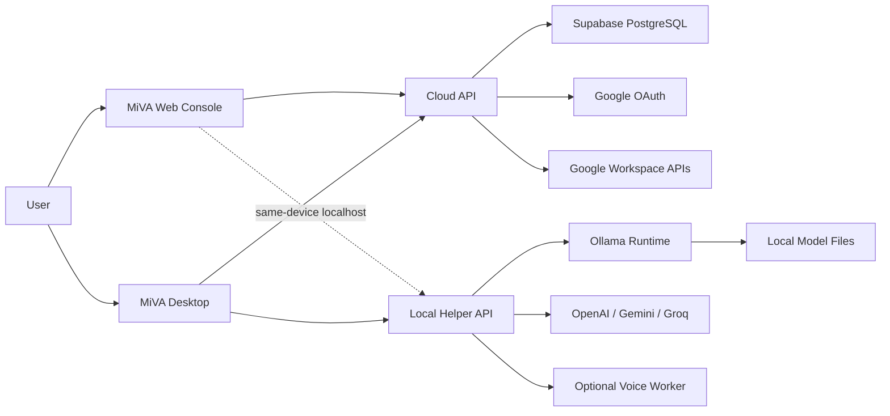
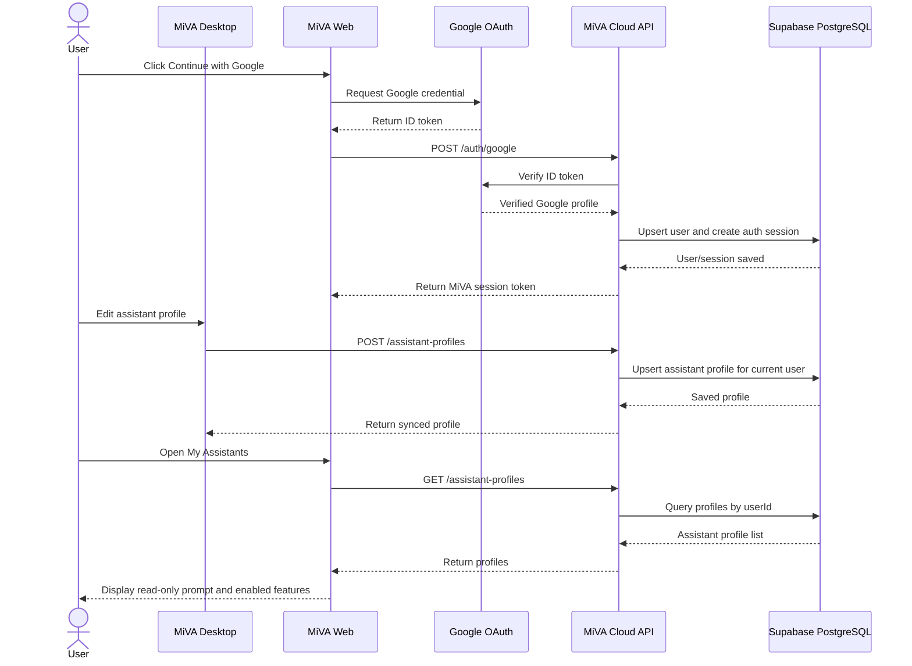
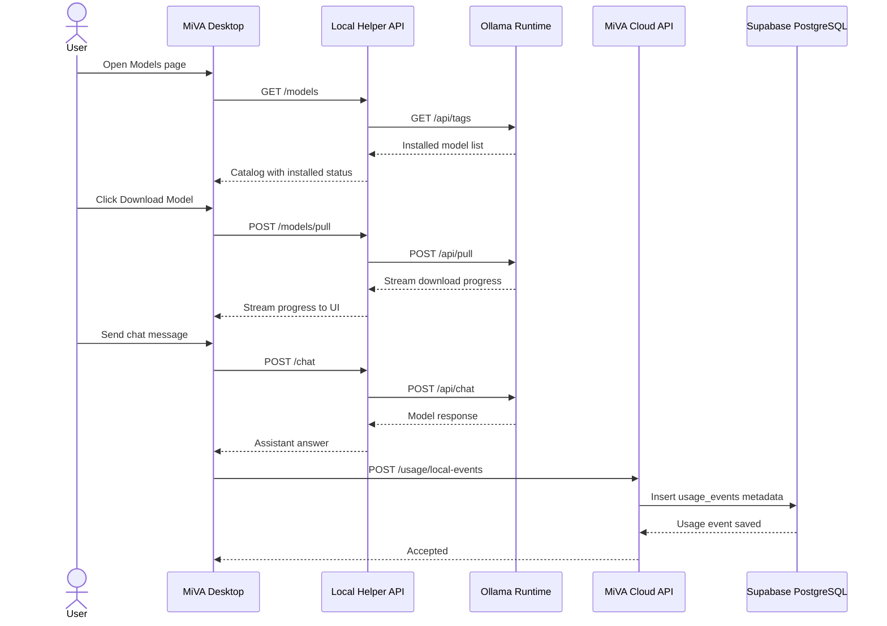
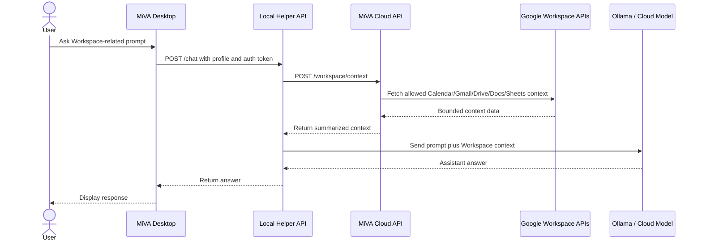
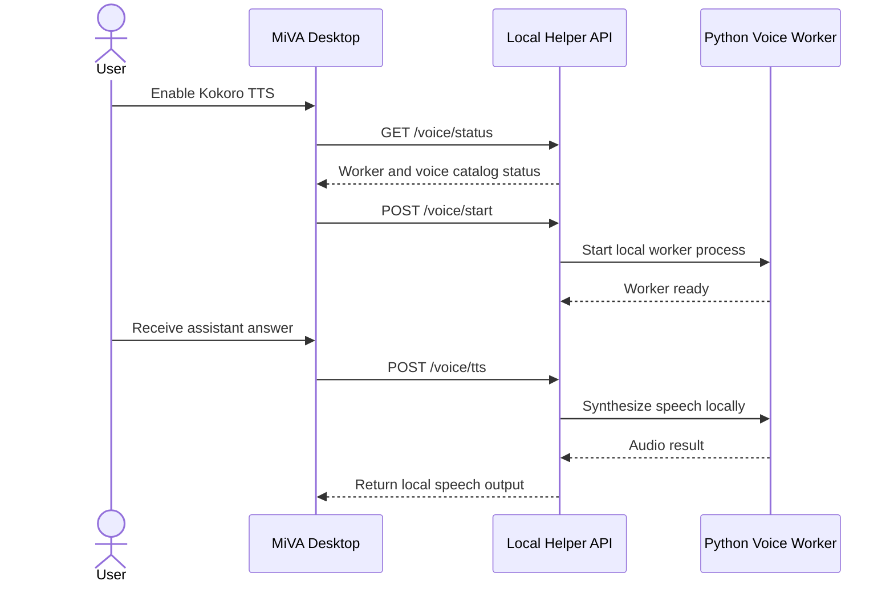

# MiVA API, Data, and Sequence Design

Last updated: 2026-06-01

This document is prepared for presentation and report material. It summarizes the current implemented APIs, the planned report APIs, the database choice, and UML sequence diagrams based on main use cases.

## 1. API Architecture Overview

MiVA uses two service layers.

```text
Cloud API
- Runs as the account, sync, database, admin, and integration service.
- Implemented with NestJS, TypeScript, Prisma, and Supabase PostgreSQL.
- Current dev URL: http://127.0.0.1:4000
- Planned production host: Railway

Local Helper API
- Runs only on the user's computer.
- Controls Ollama, local model download, local chat execution, cloud-provider routing, Google Workspace runtime context, and the optional voice worker bridge.
- Current dev URL: http://127.0.0.1:43110
```

High-level request path:



## 2. Role-Based API Groups

### Public / Health APIs

| Method | Endpoint | Caller | Purpose | Current Status |
| --- | --- | --- | --- | --- |
| GET | `/health` | Web, Desktop, monitors | Check Cloud API availability | Implemented |
| GET | Local Helper `/health` | Web, Desktop | Check Local Helper availability | Implemented |

### Authentication APIs

| Method | Endpoint | Caller | Purpose | Current Status |
| --- | --- | --- | --- | --- |
| GET | `/me` | Web, Desktop | Resolve current user from bearer token. Falls back to dev user in local mode. | Implemented |
| POST | `/auth/login` | Web dev login | Local development email/password login. Not intended for production. | Implemented |
| POST | `/auth/google` | Web | Verify Google ID token, upsert user, create MiVA session. | Implemented |
| POST | `/auth/device/start` | Desktop/Web bridge | Start temporary device auth request. | Implemented in memory |
| GET | `/auth/device/:deviceCode` | Desktop polling | Check device auth request status. | Implemented in memory |
| POST | `/auth/device/complete` | Web | Complete device login using an existing session token. | Implemented in memory |

Production policy:

```text
Primary login: Google OAuth
Admin account: role = ADMIN in users table
Local email/password login: development fallback only
```

### User Device APIs

| Method | Endpoint | Caller | Purpose | Current Status |
| --- | --- | --- | --- | --- |
| GET | `/devices` | Web, Desktop | List devices owned by the current user. | Implemented |
| POST | `/devices` | Desktop | Register or update a desktop device record. | Implemented |

Device data is a summary only. MiVA does not upload full local hardware snapshots by default.

### Assistant Profile APIs

| Method | Endpoint | Caller | Purpose | Current Status |
| --- | --- | --- | --- | --- |
| GET | `/assistant-profiles` | Web, Desktop | List current user's synced assistant profiles. | Implemented |
| POST | `/assistant-profiles` | Desktop | Create or upsert a synced assistant profile. | Implemented |
| GET | `/assistant-profiles/:profileId` | Web, Desktop | Read one assistant profile. | Implemented |
| PATCH | `/assistant-profiles/:profileId` | Desktop/API clients | Update one assistant profile. | Implemented |
| DELETE | `/assistant-profiles/:profileId` | API clients | Delete one assistant profile. | Implemented |

Current product rule:

```text
Desktop is the main editor for assistant profiles.
Web My Assistants is read-only for reviewing synced prompts and enabled features.
Assistant profiles store settings, not raw chat history.
```

### Model Catalog / Local Model APIs

Cloud API:

| Method | Endpoint | Caller | Purpose | Current Status |
| --- | --- | --- | --- | --- |
| GET | `/catalog/models` | Web, Desktop | Return the allowed lightweight model catalog. | Implemented |

Local Helper API:

| Method | Endpoint | Caller | Purpose | Current Status |
| --- | --- | --- | --- | --- |
| GET | `/ollama/status` | Web, Desktop | Detect Ollama installation, running state, and installed models. | Implemented |
| POST | `/ollama/start` | Web, Desktop | Start Ollama locally if installed. | Implemented |
| POST | `/ollama/install` | Desktop/local helper flow | Install Ollama through winget when available. | Implemented |
| GET | `/catalog/models` | Web, Desktop | Return local model catalog. | Implemented |
| GET | `/models` | Web, Desktop | Return Ollama state and catalog with installed flags. | Implemented |
| POST | `/models/pull` | Web, Desktop | Download an allowed Ollama model and stream progress. | Implemented |
| POST | `/chat` | Desktop runtime | Send a chat request to Ollama, OpenAI, Gemini, or Groq with optional Workspace context. | Implemented in local helper |

Important boundary:

```text
The Cloud API does not download model files.
Local model files are downloaded through Local Helper and stored by Ollama on the user's computer.
```

### Local Voice APIs

| Method | Endpoint | Caller | Purpose | Current Status |
| --- | --- | --- | --- | --- |
| GET | Local Helper `/voice/status` | Desktop | Check whether the optional Python voice worker is installed/running and which voices are available. | Implemented |
| POST | Local Helper `/voice/start` | Desktop | Start the optional local voice worker process. | Implemented |
| POST | Local Helper `/voice/install-kokoro` | Desktop | Install Kokoro TTS dependencies for local speech output. | Implemented |
| POST | Local Helper `/voice/tts` | Desktop runtime | Synthesize assistant speech through the local voice worker. | Implemented |

Voice boundary:

```text
Voice output is local-first. Browser/OS speech can be used without the worker; Kokoro TTS uses the optional Python voice worker on the user's computer.
```

### Provider Credential APIs

| Method | Endpoint | Caller | Purpose | Current Status |
| --- | --- | --- | --- | --- |
| GET | `/api-keys` | Web | List configured provider credential metadata. | Implemented |
| POST | `/api-keys` | Web | Save provider credential metadata/key material. | Implemented |
| POST | `/api-keys/:keyId/test` | Web | Mark/test a provider credential. | Implemented |

Security note:

```text
Production storage must encrypt provider keys at rest.
For a university MVP, full encryption may be added later, but plaintext keys should not be used in production.
```

Supported cloud providers in the current local-helper runtime:

```text
OpenAI
Gemini
Groq
```

### Google Workspace APIs

| Method | Endpoint | Caller | Purpose | Current Status |
| --- | --- | --- | --- | --- |
| GET | `/workspace/google/status` | Web, Desktop | Return the current user's Google Workspace connection state, account email, scopes, and expiry metadata. | Implemented |
| GET | `/workspace/google/auth-url` | Web, Desktop | Create a short-lived OAuth state and return a Google authorization URL. | Implemented |
| GET | `/workspace/google/callback` | Google OAuth redirect | Complete OAuth code exchange and store Workspace connection tokens. | Implemented |
| POST | `/workspace/google/token` | Web fallback | Save a Google access token for the current user when using a token-based flow. | Implemented |
| POST | `/workspace/context` | Local Helper | Fetch bounded Gmail, Drive, Docs, Sheets, or Calendar context for assistant prompts. | Implemented |
| POST | `/workspace/actions` | Local Helper | Run approved Workspace actions such as draft/schedule-oriented operations. | Implemented |

Workspace boundary:

```text
The Local Helper decides whether a prompt needs Workspace context/action based on the assistant profile and user prompt.
The Cloud API owns OAuth tokens and talks to Google Workspace APIs.
Assistant chat text is not stored in the cloud database as part of this flow.
```

### Usage and Admin APIs

| Method | Endpoint | Caller | Purpose | Current Status |
| --- | --- | --- | --- | --- |
| POST | `/usage-events` | Web | Record simple non-sensitive usage metrics. | Implemented |
| GET | `/usage/summary` | Web | Return usage summary for dashboard/report views. | Implemented |
| POST | `/usage/local-events` | Desktop | Sync local runtime usage metadata without chat text. | Implemented |
| GET | `/admin/stats` | Admin Web | Return product-level admin analytics. | Implemented |

Admin policy:

```text
Admin accounts are for the web analytics/dashboard only.
Admin users should not create or run assistant profiles in the desktop app.
```

### Planned Report APIs

These endpoints are useful for the final report/presentation, but they are not implemented in the current codebase yet.

| Method | Endpoint | Caller | Purpose | Implementation Plan |
| --- | --- | --- | --- | --- |
| GET | `/reports/summary` | Admin Web | Return a report-friendly summary combining user/device/profile/model/usage data. | Can wrap `/admin/stats` and `/usage/summary`. |
| POST | `/reports/pdf` | Admin Web | Generate or request a PDF export of admin/report data. | Add later as a report module or background job. |
| GET | `/reports/:id` | Admin Web | Retrieve generated report metadata or download URL. | Future. |

Recommended mapping:

```text
GET /reports/summary
  -> internally calls admin statistics and usage aggregation logic

POST /reports/pdf
  -> accepts report filters
  -> creates a PDF export job
  -> returns report id or download URL
```

## 3. Database and ORM

MiVA currently uses:

```text
Database: Supabase PostgreSQL
ORM: Prisma
API database access: Prisma Client
Migration control: Prisma Migrate
Planned backend host: Railway
Planned frontend host: Vercel
```

Why PostgreSQL:

```text
- Users, sessions, devices, assistant profiles, credentials, and usage events are relational.
- Prisma gives explicit schema and migration history.
- JSON columns can handle semi-structured assistant prompt settings and capability flags.
- Supabase provides managed PostgreSQL without requiring MiVA to use Supabase Auth.
```

Core tables:

| Table | Main Purpose |
| --- | --- |
| `users` | MiVA account identity, Google subject, role, locale |
| `auth_sessions` | Hashed session tokens |
| `devices` | Registered desktop device summaries |
| `assistant_profiles` | Synced assistant settings, prompt, model/provider choice |
| `model_preferences` | Preferred local/cloud model choices |
| `provider_credentials` | Provider API key metadata and stored credential value |
| `workspace_connections` | Google Workspace connection state and token metadata |
| `tool_permissions` | Future tool/MCP permission policies |
| `usage_events` | Non-sensitive usage and runtime metrics |

Data boundary:

```text
Stored in cloud:
- account data
- device summaries
- assistant profile settings
- provider/workspace metadata
- usage/admin metrics

Not stored in cloud by default:
- raw chat transcripts
- local model files
- local files
- microphone/audio data
- raw terminal/tool output
```

## 4. UML Sequence Diagram 1: Google Login and Assistant Sync

Use case:

```text
User signs in with Google, creates/edits an assistant in Desktop, and syncs it so Web can review the profile.
```



## 5. UML Sequence Diagram 2: Local Model Download and Runtime Usage Reporting

Use case:

```text
User downloads a local model, runs a local chat in Desktop, and MiVA sends non-sensitive usage metadata to the cloud.
```



Privacy point:

```text
The usage event stores provider/model/duration/success counters.
It does not store the raw user message or assistant response by default.
```

## 6. UML Sequence Diagram 3: Google Workspace Context and Action

Use case:

```text
User enables Google Workspace for an assistant, asks a Workspace-related question, and the runtime uses bounded Workspace context or an approved action.
```



If the prompt requests a write-like Workspace operation, Local Helper plans the action and calls `POST /workspace/actions`. The API server enforces the stored Google Workspace connection and returns a result or a user-confirmation message.

## 7. UML Sequence Diagram 4: Optional Local Voice Output

Use case:

```text
User enables Kokoro TTS for an assistant and MiVA speaks the assistant response locally.
```



## 8. Current vs Planned API Summary

Current implementation:

```text
GET  /health
GET  /me
POST /auth/login
POST /auth/google
POST /auth/device/start
GET  /auth/device/:deviceCode
POST /auth/device/complete
GET  /catalog/models
GET  /devices
POST /devices
GET  /api-keys
POST /api-keys
POST /api-keys/:keyId/test
GET  /assistant-profiles
POST /assistant-profiles
GET  /assistant-profiles/:profileId
PATCH /assistant-profiles/:profileId
DELETE /assistant-profiles/:profileId
POST /usage-events
GET  /usage/summary
POST /usage/local-events
GET  /admin/stats
GET  /workspace/google/status
GET  /workspace/google/auth-url
GET  /workspace/google/callback
POST /workspace/google/token
POST /workspace/context
POST /workspace/actions
```

Current Local Helper implementation:

```text
GET  /health
GET  /ollama/status
POST /ollama/start
POST /ollama/install
GET  /catalog/models
GET  /models
POST /models/pull
POST /chat
GET  /voice/status
POST /voice/start
POST /voice/install-kokoro
POST /voice/tts
```

Planned report API:

```text
GET  /reports/summary
POST /reports/pdf
GET  /reports/:id
```

## 9. Presentation Notes

Key talking points:

```text
1. MiVA is local-first: actual local model execution stays on the user's computer.
2. The cloud API manages identity, sync, settings, and admin statistics.
3. Web is a console for setup/review/admin, not the default local chat runtime.
4. Desktop and Local Helper handle Ollama, model downloads, and local chat.
5. Local Helper can route runtime chat to Ollama, OpenAI, Gemini, or Groq.
6. Google Workspace access is mediated by the Cloud API OAuth connection and bounded context/action endpoints.
7. PostgreSQL stores structured settings and metrics, not private chat transcripts.
8. Admin analytics use usage_events and assistant profile metadata.
9. Report APIs are planned as a wrapper/export layer over current usage/admin APIs.
```
