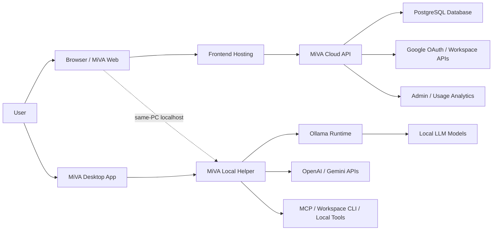
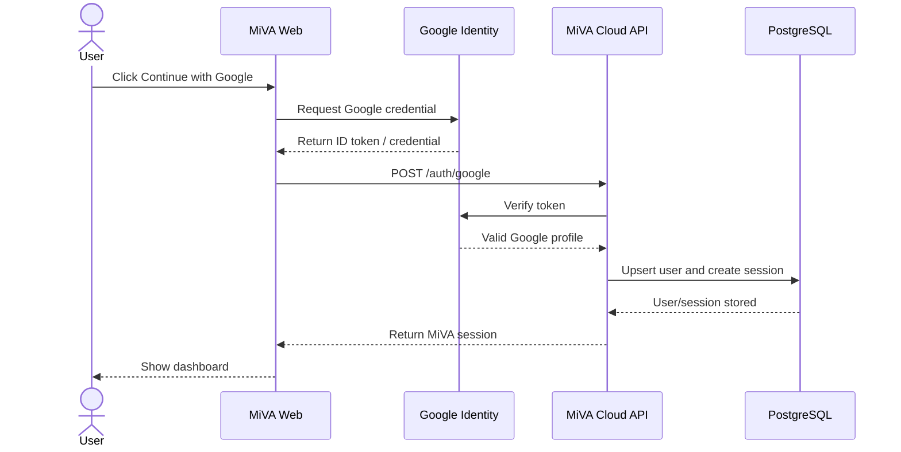
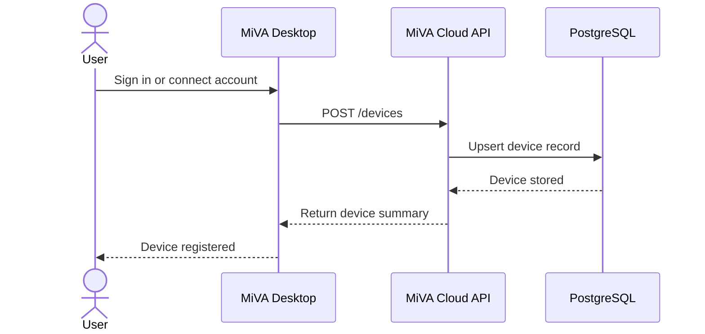
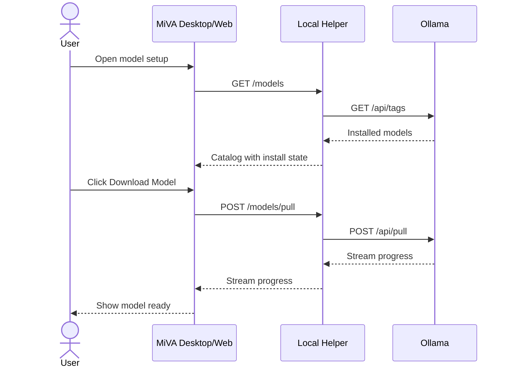
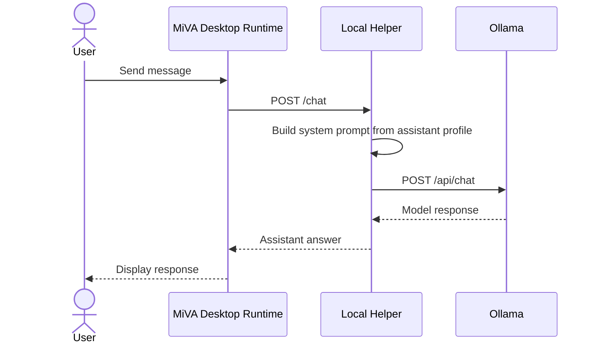
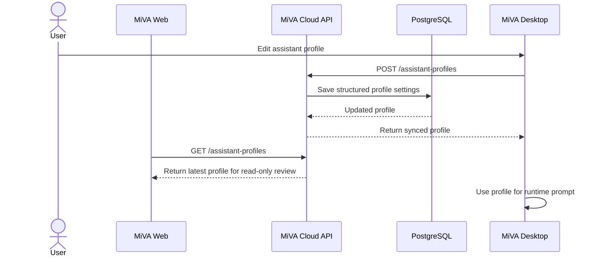
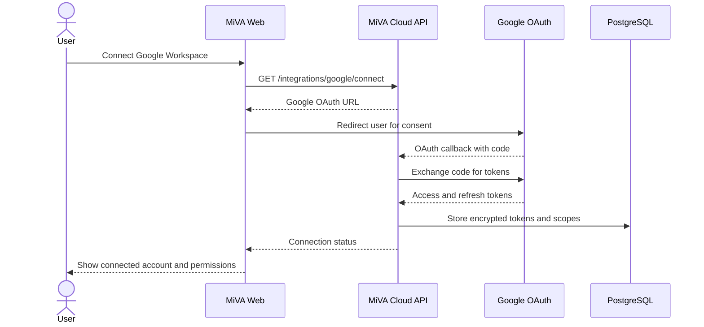

# MiVA Software Design Document

Last updated: 2026-05-07

## 1. Project Overview

MiVA is a local-first personal AI assistant platform. Its main goal is to help non-technical users install, configure, and run an AI assistant on their own computer without manually handling model runtimes, prompts, terminal commands, or OAuth/tool wiring.

The project uses a hybrid local-cloud architecture:

- Local execution stays on the user's device through MiVA Desktop, MiVA Local Helper, Ollama, and local model files.
- The web service manages accounts, assistant settings, model/provider preferences, OAuth integrations, device visibility, and admin statistics.
- Sensitive local actions such as installing Ollama, reading hardware information, running local tools, using microphone input, or chatting with local models must happen through the desktop app/local helper with user permission.

## 2. Current Implementation Scope

The current repository is an MVP workspace, not the final production backend.

```text
apps/
  desktop/        Tauri + React desktop app
  local-helper/   Node.js local bridge for Ollama, provider calls, and local chat
  web/            React/Vite web dashboard
  api/            temporary Node.js API skeleton
packages/
  shared/         shared model catalog and constants
infra/
  docker-compose.yml
docs/
  product, architecture, design, and engineering notes
```

Current working services:

```text
MiVA Web:          http://127.0.0.1:5173
MiVA Local Helper: http://127.0.0.1:43110
MiVA API:          http://127.0.0.1:4000
Ollama:            http://localhost:11434
Desktop dev UI:    http://localhost:1420
```

## 3. High-Level Architecture



### Layer Responsibilities

```text
Browser/Web UI
- Account login
- Assistant profile editing
- Device and model status visibility
- API key and integration settings
- Usage and admin dashboards

Frontend hosting
- Hosts the production web dashboard
- Serves static React/Next.js assets
- Provides HTTPS and public access

Cloud API server
- Auth/session management
- User/device/assistant profile persistence
- Google OAuth and Workspace integration
- Usage/admin statistics
- Future billing and synchronization

Data/infrastructure layer
- PostgreSQL for durable application data
- Prisma migrations for schema control
- Redis/queue later only when background jobs become real

External services
- Google OAuth / Workspace APIs
- OpenAI/Gemini cloud models
- Ollama for local model runtime
- MCP or CLI tools through local helper only
```

## 4. System Architecture / Deployment

### Local Development Deployment

```text
User PC
+ MiVA Desktop App
+ MiVA Local Helper on 127.0.0.1:43110
+ Ollama on localhost:11434
+ MiVA Web dev server on 127.0.0.1:5173
+ Temporary MiVA API on 127.0.0.1:4000
```

### Planned Production Deployment

```text
User Browser
  -> Vercel-hosted MiVA Web Dashboard
  -> Railway-hosted MiVA Cloud API
  -> Supabase PostgreSQL
  -> Google OAuth / Workspace APIs

User Desktop
  -> MiVA Desktop App
  -> MiVA Local Helper
  -> Ollama / Local Models
  -> Optional local tools and MCP servers
```

The cloud server cannot directly access a user's computer. Remote web control must be mediated by a paired desktop app that initiates connection to the cloud API.

### Selected Hosting Plan

```text
Frontend hosting: Vercel
Backend hosting:  Railway
Database hosting: Supabase PostgreSQL
ORM:              Prisma
```

Vercel is used only for the MiVA web frontend. The NestJS backend runs as a separate long-running service on Railway because future assistant sync, OAuth callbacks, Workspace integration, and runtime coordination should not depend on serverless function size, memory, or duration limits.

Supabase is used as the managed PostgreSQL database provider only. The MiVA backend connects to Supabase PostgreSQL through Prisma using the database connection string.

## 5. Technology Stack

### Current MVP Stack

| Area | Technology | Role |
| --- | --- | --- |
| Web frontend | React, Vite, TypeScript, Tailwind CSS | Browser dashboard and web console |
| Desktop app | Tauri v2, React, TypeScript, Tailwind CSS | Local setup, runtime, hardware, model control |
| Local helper | Node.js HTTP server | Local bridge to Ollama and provider APIs |
| API server | NestJS, TypeScript | Cloud auth, assistant sync, usage reporting, admin APIs |
| Local model runtime | Ollama | Local LLM model download and inference |
| Shared package | JavaScript module | Shared model catalog and constants |
| Version control | Git / GitHub | Source control and collaboration |

### Planned Production Stack

| Area | Technology | Role |
| --- | --- | --- |
| Web frontend | React/Next.js or React Router SPA | Hosted dashboard and account UI |
| Desktop app | Tauri v2 + React | Local-first setup and runtime |
| Backend API | NestJS + TypeScript | Structured auth, devices, profiles, integrations, and admin APIs |
| Database | PostgreSQL | Durable user, device, profile, OAuth, and usage data |
| ORM | Prisma | Typed schema, migrations, and database access |
| Background jobs | Redis + BullMQ later | Long-running sync/indexing jobs when needed |
| OAuth | Google OAuth 2.0 | Google login and Workspace authorization |
| Frontend deployment | Vercel | Hosts the public MiVA web dashboard |
| Backend deployment | Railway | Runs the long-running NestJS API service |
| Database hosting | Supabase PostgreSQL | Managed PostgreSQL database used through Prisma |

## 6. Code Conventions

### Naming

```text
React components: PascalCase
Types/interfaces: PascalCase
Functions: camelCase
Variables: camelCase
Constants: SCREAMING_SNAKE_CASE only for true constants
Component files: PascalCase.tsx
Hooks/util files: camelCase.ts
Code identifiers: English
User-facing text: Korean/English localization-ready
```

### Frontend Rules

- Use functional React components.
- Keep UI components focused on rendering.
- Move side effects and external calls into hooks or service modules.
- Avoid business logic directly inside JSX.
- Use Tailwind CSS from the local build setup, not CDN scripts.
- Use Stitch outputs as design references, not direct production code.

### Backend Rules

- Keep cloud-server responsibilities separate from local-helper responsibilities.
- Use structured modules in the production API.
- Do not expose arbitrary shell execution.
- Validate model names against an allowlist.
- Store structured assistant preferences instead of huge hardcoded prompt strings.
- Generate runtime prompts from structured profile data.

### Security Rules

- Local conversations stay local by default.
- Do not upload local chat contents to the cloud database.
- Do not store plaintext provider API keys.
- OAuth tokens must be encrypted at rest.
- Google Workspace scopes must be minimal and clearly explained.
- Local privileged actions require explicit user approval.

## 7. Data Design

### Core Entities

```text
users
devices
assistant_profiles
model_preferences
provider_credentials
workspace_connections
tool_permissions
usage_events
```

### Initial Relational Sketch

```text
users
  id
  email
  display_name
  locale
  role
  created_at
  updated_at

devices
  id
  user_id
  name
  os
  app_version
  last_seen_at
  created_at
  updated_at

assistant_profiles
  id
  user_id
  name
  description
  use_case
  answer_style
  language_use
  local_mode
  provider
  model
  prompt_settings_json
  is_default
  status
  created_at
  updated_at

model_preferences
  id
  user_id
  assistant_profile_id
  provider
  local_model
  cloud_model
  fallback_policy
  created_at
  updated_at

provider_credentials
  id
  user_id
  provider
  label
  encrypted_key
  status
  last_validated_at
  created_at
  updated_at

workspace_connections
  id
  user_id
  provider
  account_email
  encrypted_access_token
  encrypted_refresh_token
  scopes_json
  status
  connected_at
  updated_at

tool_permissions
  id
  user_id
  device_id
  tool_id
  permission_scope_json
  risk_level
  enabled
  created_at
  updated_at

usage_events
  id
  user_id
  device_id
  assistant_profile_id
  mode
  provider
  model
  event_type
  input_chars
  output_chars
  duration_ms
  success
  created_at

```

### Data Storage Policy

Cloud database policy:

```text
The cloud database does not store local chat messages by default.
Web is treated as setup/admin/sync console.
Local model chat happens in MiVA Desktop through Local Helper and Ollama.
```

Local desktop storage policy:

```text
MiVA Desktop keeps a small local data store for assistant profiles, setup state, device identity, and optional local conversations or memory snapshots. Runtime states such as Ollama status, installed model lists, gcloud/gws status, and download progress are detected on demand instead of stored permanently.
```

See `docs/LOCAL_DATA_STORE.md` for the detailed local storage policy.

| Data | Default Location | Notes |
| --- | --- | --- |
| User account | Cloud DB | Required for web account features |
| Device records | Cloud DB | Stores summary status only |
| Assistant profiles | Cloud DB, synced to desktop | Structured profile data |
| Local chat history | Local device only by default | Not stored in the cloud DB |
| Local model files | User PC through Ollama | Never uploaded to cloud |
| OAuth tokens | Cloud DB encrypted or local keychain | Depends on integration mode |
| Provider API keys | Prefer local keychain for MVP | Server storage requires encryption |
| Usage statistics | Cloud DB | Non-sensitive summaries only, no chat text |

## 8. Web / App Views

### Current Web Views

| View | Purpose |
| --- | --- |
| Dashboard | Connection health, active model, local status overview |
| Devices | Hardware and desktop/local service visibility |
| Models | Local model catalog and model download actions |
| My Assistants | Read-only review of synced assistant prompts and enabled features |
| API Keys | Cloud provider key registration and test UI |
| Usage | Usage summary and recent events |
| Billing | Placeholder plan UI |
| Integrations | Google Workspace, MCP, and external integration direction |
| Voice / Character | Future voice/avatar configuration direction |
| Admin | Admin analytics and top usage metrics |
| Settings | General settings placeholder |

### Desktop App Views

| Mode | View | Purpose |
| --- | --- | --- |
| Setup | Welcome / Survey | Gather user goals and answer preferences |
| Setup | Hardware Check | Read local hardware for model recommendation |
| Setup | Recommendation | Explain recommended lightweight model |
| Setup | Ollama Setup | Install/start Ollama with explicit approval |
| Setup | Model Setup | Download and validate local model |
| Runtime | Local Chat | Verify assistant works with local/cloud provider |
| Runtime | Character Preview | Future visible assistant/avatar runtime |
| Settings | Runtime Settings | Language, provider, local runtime information |

### Planned Web Modes

```text
Setup mode
- Overview
- Connections
- Model Setup
- Assistant Rules
- Validation
```

Web is not the default runtime chat surface. Launch Assistant and local model conversation should happen in MiVA Desktop runtime mode. The web app remains focused on setup, profile management, device visibility, integration settings, and admin views.

## 9. API Design

### Current API Skeleton

```text
GET  /health
POST /auth/login
POST /auth/google
POST /auth/device/start
GET  /auth/device/:code
POST /auth/device/complete
GET  /assistant-profiles
POST /assistant-profiles
PATCH /assistant-profiles/:id
DELETE /assistant-profiles/:id
GET  /api-keys
POST /api-keys
POST /api-keys/:id/test
GET  /usage/summary
POST /usage/local-events
POST /usage-events
GET  /admin/stats
```

Planned report/export endpoints:

```text
GET  /reports/summary
POST /reports/pdf
GET  /reports/:id
```

### Current Local Helper API

```text
GET  /health
GET  /ollama/status
POST /ollama/start
POST /ollama/install
GET  /catalog/models
GET  /models
POST /models/pull
POST /chat
```

### Planned Production API Modules

```text
AuthModule
UsersModule
DevicesModule
AssistantProfilesModule
ModelPreferencesModule
ProviderCredentialsModule
GoogleWorkspaceModule
ToolPermissionsModule
UsageModule
AdminModule
```

## 10. UML Sequence Designs

### Google OAuth Login



### Desktop Device Registration



### Local Model Setup



### Local Chat Request



### Assistant Profile Edit



### Google Workspace Authorization



## 11. Security and Privacy Design

- Local model conversations should remain local by default.
- Local chat messages are not stored in the cloud database by default.
- The cloud server stores device summaries, not detailed local hardware, unless the user opts in.
- OAuth scopes should be requested incrementally.
- Google Workspace write actions should require confirmation.
- Local helper should bind to localhost and use CORS allowlists.
- Production local-helper access should require signed local requests or a desktop-issued local session token.
- Arbitrary shell execution must never be exposed through web requests.

## 12. Development Roadmap

### Phase 1: Local Setup Validation

- Desktop setup flow
- Hardware scan
- Ollama install/start
- Model download
- Local chat

### Phase 2: Web Account and Device Sync

- NestJS API
- Railway backend deployment
- Supabase PostgreSQL + Prisma
- Auth and Google login
- Device registration and sync
- Assistant profile persistence

### Phase 3: Assistant Profile and Runtime

- Web profile editor
- Desktop runtime mode
- Launch Assistant flow in Desktop
- Local/cloud provider routing
- Local session/activity/log views

### Phase 4: Integrations

- Google Workspace OAuth
- Calendar read/draft actions
- Gmail/Drive support
- MCP/tool permission model

### Phase 5: Voice and Character

- STT/TTS
- Character runtime
- Live2D or avatar integration
- Push-to-talk and voice interaction

## 13. Open Decisions

- Whether provider API keys are stored only locally or encrypted in the cloud.
- Which Google Workspace scopes are acceptable for the first integration release.
- Whether chat history remains local-only forever by default or supports optional sync.
