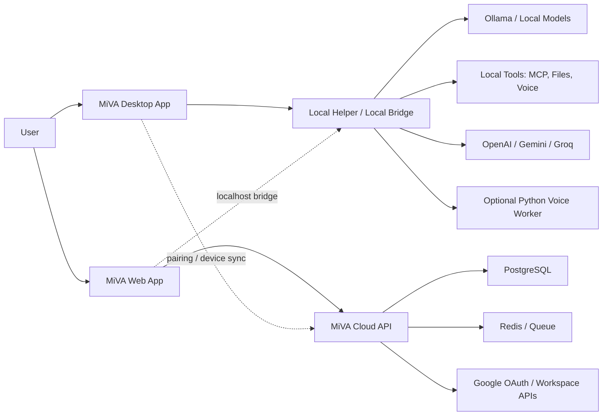

# MiVA Technical Stack and Service Architecture

Last updated: 2026-06-01

## Purpose

MiVA is not just a normal hosted web app. The product needs to help non-technical users set up and run a personal AI assistant on their own computer, while also supporting a web service for accounts, preferences, cloud models, integrations, and later paid/managed features.

The correct long-term structure is:

- Desktop app for local setup, local runtime, hardware access, voice, character display, and local model control.
- Local helper/bridge for safe communication between the desktop app, Ollama, local tools, and the web dashboard.
- Web app for account management, preferences, model/provider settings, integrations, and remote visibility.
- Cloud API server for auth, database, synchronization, OAuth integrations, and server-side business logic.

## Current MVP Structure

```txt
apps/
  desktop/        Tauri + React desktop app
  local-helper/   Node local bridge for Ollama, provider calls, Workspace context, and voice
  web/            React web console
  api/            NestJS API for auth, sync, usage, and admin features
  voice-worker/   Optional Python worker for local Kokoro TTS
packages/
  shared/         shared lightweight model catalog
docs/
  PRD.md
  RULES.md
  TODO.md
  DESIGN.md
```

This is acceptable for MVP validation. The local-helper remains intentionally simple because it only runs on the user's computer, while the cloud API now uses NestJS so account, sync, usage, and admin endpoints can be separated into controller/service/module structure.

## Production Architecture



Important rule: the cloud server cannot directly control a user's computer. Anything that installs Ollama, checks hardware, reads local files, uses the microphone, or runs local tools must go through the installed desktop app/local helper with user permission.

## Recommended Tech Stack

### Desktop App

Use:

- Tauri v2
- React
- TypeScript
- Tailwind CSS
- Rust commands for native OS access

Why:

- Better fit than a pure web app for local model setup, hardware checks, microphone access, tray/background behavior, and future virtual character runtime.
- Smaller and more native than Electron.
- Already adopted in the current repo.

Responsibilities:

- Setup mode: survey, hardware scan, Ollama install/start, model download, API key entry.
- Runtime mode: chat, assistant character, microphone, TTS/STT, local provider status.
- Local permissions: microphone, local files, model folders, tool execution.
- Secure local secrets: eventually use OS keychain instead of localStorage or plain `.env`.

### Local Helper

Current:

- Node.js HTTP server in `apps/local-helper/src/server.mjs`

Recommended next structure:

```txt
apps/local-helper/src/
  server.mjs
  config.mjs
  prompt.mjs
  routes/
    health.mjs
    chat.mjs
    models.mjs
    ollama.mjs
  services/
    ollama.mjs
    openai.mjs
    gemini.mjs
    hardware.mjs
    tools/
      claw-code.mjs
      google-workspace-cli.mjs
    voice/
      stt.mjs
      tts.mjs
```

Responsibilities:

- Provide localhost API for desktop and web bridge checks.
- Manage Ollama status, model list, model pull progress, and local chat.
- Route cloud model calls during local testing.
- Build system prompts from survey/preferences.
- Later: expose controlled tool execution for Claw Code, Google Workspace CLI, MCP servers, local file search, STT, and TTS.

Security requirements:

- Bind to `127.0.0.1` where possible.
- Require pairing token for web-to-local-helper access.
- Use CORS allowlist.
- Never expose arbitrary shell execution.
- Every local tool action must be explicit, scoped, and auditable.

### Web App

MVP/current:

- React
- Vite
- Tailwind CSS

Production recommendation:

- Next.js or React Router-based SPA
- TypeScript
- Tailwind CSS
- i18n for Korean/English

Use the web app for:

- Account login.
- User preferences.
- Model/provider preference management.
- Device list and connection status.
- Integration setup pages.
- Google Workspace OAuth flow.
- Billing or subscription pages later.
- Documentation/help pages for normal users.

Do not rely on the web app alone for:

- Installing Ollama.
- Reading PC hardware.
- Accessing microphone reliably.
- Running local tools.
- Showing always-on assistant/character overlay.

Those need the desktop app/local helper.

### Cloud API Server

Recommended:

- NestJS
- TypeScript
- REST first, WebSocket/SSE later where needed

Why NestJS:

- Same language as React/Tauri frontend code.
- Good structure for auth, modules, providers, integrations, and background jobs.
- Easier to keep contracts and types consistent across web, desktop, and API.

Possible modules:

```txt
AuthModule
UsersModule
DevicesModule
PreferencesModule
ProvidersModule
IntegrationsModule
GoogleWorkspaceModule
BillingModule
TelemetryModule
```

Use FastAPI only if the backend becomes heavily Python/ML-centric. For MiVA's near-term needs, NestJS is the better default because most work is product/API/integration logic, not custom ML serving.

### Database

Recommended:

- PostgreSQL
- Prisma ORM

Why:

- PostgreSQL is stable for user accounts, devices, preferences, integration state, and usage events.
- Prisma works well with TypeScript/NestJS and gives clear schema migrations.

Core tables later:

```txt
users
auth_sessions
devices
assistant_profiles
model_preferences
provider_credentials
workspace_connections
tool_permissions
usage_events
```

Important security note:

- Do not store personal OpenAI/Gemini/Groq keys in plaintext.
- For desktop-first usage, prefer local OS keychain storage.
- If web-managed provider keys are needed later, store encrypted secrets on the server and design rotation/deletion from the start.

### Background Jobs and Realtime

Recommended later:

- Redis
- BullMQ
- WebSocket or Server-Sent Events

Use for:

- Long-running sync jobs.
- Google Workspace indexing/sync.
- Device connection status.
- Tool execution progress.
- Model download progress if routed through a local bridge connection.

## How Web and Desktop Should Connect

### Local Same-PC Connection

For a user opening MiVA web on the same PC where the desktop app is running:

```txt
Web App -> http://127.0.0.1:43111/health -> Desktop bridge
Web App -> http://127.0.0.1:43110/health -> Local helper
```

This is useful for:

- Showing "Desktop connected".
- Showing Ollama status.
- Showing installed local models.
- Launching setup actions through approved local endpoints.

Production needs:

- Pairing token.
- CORS allowlist.
- Request signing or session token.
- User confirmation for privileged actions.

### Remote Web Connection

If the user opens the web app on another device, the browser cannot directly reach the user's local helper.

Use:

```txt
Desktop app -> persistent connection -> Cloud API
Web app -> Cloud API -> device status/actions
```

The desktop app must initiate the connection to the server. The server can then relay approved commands or status updates.

## AI Provider Strategy

### Local Models

Primary local provider:

- Ollama

Initial lightweight local models:

- `qwen3:4b`
- `gemma3:4b`
- `llama3.2:3b`
- `phi3:mini`

Local models are best for:

- Privacy-first chat.
- Offline use.
- Basic assistant behavior.
- Normal-user local setup validation.

### Cloud Models

Initial cloud providers:

- Gemini
- OpenAI

Current Gemini setup:

- Default: `gemini-2.5-flash`
- Fallback: `gemini-2.5-flash -> gemini-2.5-flash-lite`
- Pro remains selectable: `gemini-2.5-pro`

Cloud models are best for:

- Better Korean/English quality.
- Long context.
- Google Workspace integration.
- Stronger reasoning.
- Users with weaker local hardware.

## Future Integrations

### Claw Code

Recommended place:

- Local helper tool service first.
- Cloud API only stores permissions/preferences.

Reason:

- It may need local project files and local execution.
- User must approve workspace access.
- Arbitrary command execution must be carefully sandboxed.

### Google Workspace CLI / Google Workspace APIs

Recommended split:

- OAuth flow: Web app + Cloud API.
- Local CLI execution: Desktop/local helper only if local execution is useful.
- API-based integration: Cloud API for Gmail, Calendar, Drive metadata, and sync.

For normal users, pure CLI setup may be too technical. Long term, OAuth through web is better UX than asking users to configure a CLI manually.

### Microphone Input, STT, TTS

Recommended place:

- Desktop app for microphone permission and always-on UX.
- Local helper for STT/TTS service calls or local models.
- Cloud API only for account/preferences, not raw microphone streaming by default.

Reason:

- Microphone permission is OS/browser sensitive.
- Desktop app is better for push-to-talk, wake mode, tray, and virtual character sync.
- Privacy expectations are clearer when audio stays local unless the user chooses a cloud STT provider.

See `docs/STT_STRATEGY.md` for the STT mode split, local model choices, and hardware guidance.

See `docs/CODING_AGENT_POLICY.md` for the Claw Code and coding-model policy. MiVA should require a cloud API model by default for code editing and repository automation, while keeping local models available for read-only code explanation.

### Virtual Character Runtime

Recommended place:

- Desktop app runtime mode.

Reason:

- Needs persistent window, overlay behavior, microphone/TTS sync, and possibly GPU/canvas rendering.
- Web can manage character settings, but the visible assistant should run in the desktop app.

## Development Phases

### Phase 1: Local Setup Validation

Goal:

- Prove normal users can install/run a local AI assistant.

Stack:

- Tauri desktop app
- Node local-helper
- Ollama
- React/Tailwind UI
- Gemini/OpenAI optional cloud test

### Phase 2: Web Account and Device Sync

Goal:

- Connect desktop app to a real web service.

Add:

- NestJS API
- PostgreSQL
- Prisma
- Auth
- Device pairing
- Web dashboard status

### Phase 3: Provider and Prompt Profiles

Goal:

- Let users manage assistant behavior from web/app.

Add:

- Assistant profiles
- Prompt templates
- Provider preferences
- Local/cloud/hybrid mode
- Secure key storage

### Phase 4: Integrations

Goal:

- Add useful assistant capabilities.

Add:

- Google Workspace OAuth
- Google Workspace actions
- MCP tools
- Claw Code local tool integration
- File and project context

### Phase 5: Voice and Character

Goal:

- Turn MiVA into a visible and voice-enabled assistant.

Add:

- STT
- TTS
- Push-to-talk
- Character runtime
- Open LLM VTuber-style character integration

## Near-Term Engineering Recommendation

Do not build the full cloud backend before the local assistant flow is stable.

Recommended next steps:

1. Split `server.mjs` into `config`, `prompt`, and provider services.
2. Keep current desktop app and local-helper running.
3. Add a minimal NestJS API only for `health`, `users`, `devices`, and `pairing`.
4. Connect web dashboard to both:
   - MiVA Cloud API for account/device data.
   - Local helper for same-PC local status.
5. Add PostgreSQL + Prisma after the first real account/device schema is decided.

This keeps the project realistic while preserving the long-term SaaS structure.
